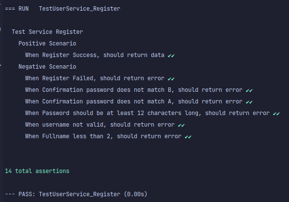
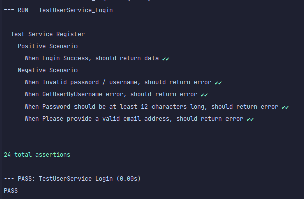

# Registration and Login
- [Installing](#installing)
- [Running Ip and Port](#IpAndPort)
- [Register And Login](#register&login)
- [Unittest](#unittest)

## installing
    untuk menjalankan aplikasi ini sebagai berkut

```sh
    $ git clone https://github.com/rasyidmm/edufund.git
    $ cd edufund
    $ docker-compose up  
```
## IpAndPort
    Aplikasi berjalan pada IP 172.27.0.2:8080
    untuk DB berjalan pada IP 172.27.0.3:3306

## register&login
    dapat melakukan dengen postman
  - [Link Postman](https://github.com/rasyidmm/edufund/blob/master/example/edufund.postman_collection.json)
    
## unittest


